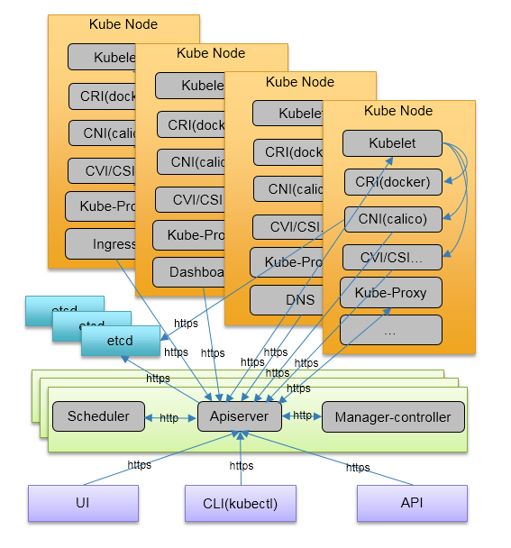

# ansible-kubernetes

Use ansible to install kubernetes cluster platfrom.



## Setup
* Setup ansible(2.4+ advised) and ssh configuration.
* Update inventories to meet your requirement of deployment regarding to various ENV.
* Generate CA key and cert: ```ansible-playbook -i inventories/dev/hosts 01ca.yml.```
* Initialize hosts(cfssl, CA certs, firewalld, selinux, sysctl): ``` ansible-playbook -i inventories/dev/hosts 02init.yml```.
* Setup etcd cluster: ```ansible-playbook -i inventories/dev/hosts 03etcd.yml```.
* Setup kube-master cluster: ```ansible-playbook -i inventories/dev/hosts 04kube-master.yml```.
* Install kubctl: ```ansible-playbook -i inventories/dev/hosts 05kubectl.yml```.
* Install docker: ```ansible-playbook -i inventories/dev/hosts 06docker.yml```.
* Setup kube-node cluster: ```ansible-playbook -i inventories/dev/hosts 07kube-node.yml```.
* Setup calico network: ```ansible-playbook -i inventories/dev/hosts 08calico.yml```.
* Setup dns service in kube: ansible-playbook -i inventories/dev/hosts 09dns.yml.
* Setup dashboard(UI) for kube: ansible-playbook -i inventories/dev/hosts 10dashboard.yml.

## Components List
* Kube Master: multi apiserver, scheduler cluster, controller manager cluster
* Kube Node: kubelet, kube-proxy
* Kube Storage: etcd cluster
* Security: enable SSL/TLS
* CRI: docker
* CNI: calico
* Ingress: undo
* DNS: todo
* UI: undo
* CLI: kubectl
* Logger: todo
* Monitor: todo
* Alerter: todo
* Storage: todo(both filesystem and block)
* Registry: todo

## Binaries download url list 
* Kube: https://github.com/kubernetes/kubernetes/releases
* Docker: https://github.com/moby/moby/releases
* Calicoctl: https://github.com/projectcalico/calicoctl/releases
* CNI: https://github.com/containernetworking/cni/releases
* CNI-Plugin: https://github.com/containernetworking/plugins/releases
* CFSSL: https://pkg.cfssl.org/
* ETCD: https://github.com/coreos/etcd/releases
* Docker Compose: https://github.com/docker/compose/releases

## Images list
### calico network images
* calico/node
* calico/cni
* calico/kube-controllers

### pod image
* anzersy/pause-amd64

## Helpful links
* https://docs.docker.com/
* https://cfssl.org
* http://docs.ansible.com
* https://kubernetes.io
* https://docs.projectcalico.org
* https://github.com/containernetworking
* https://etcd.readthedocs.io/en/latest/

